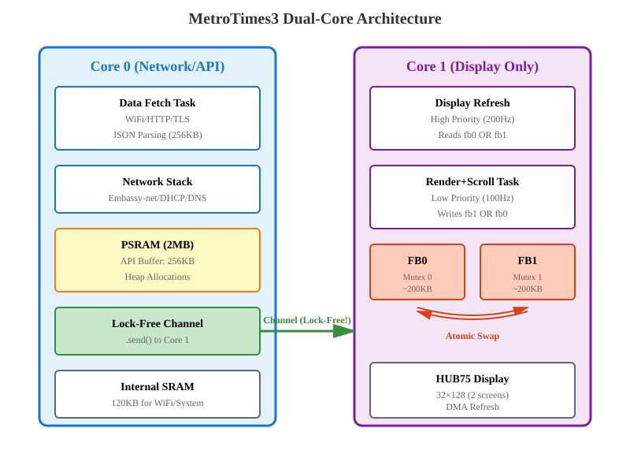
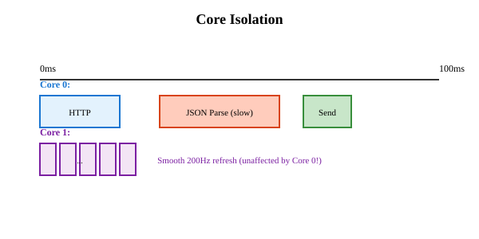
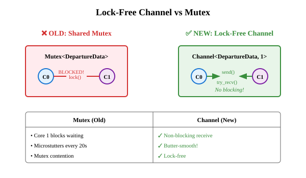
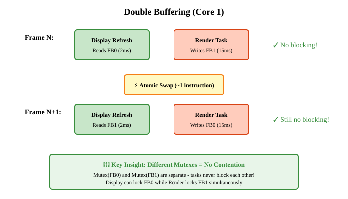
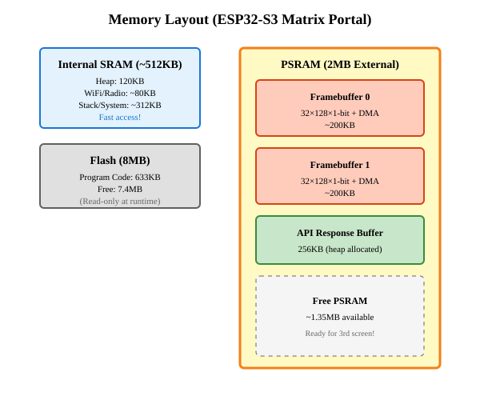
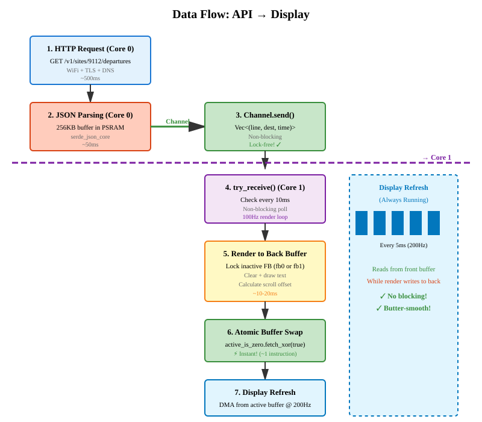

# MetroTimes3 Architecture

## Overview

MetroTimes3 uses a sophisticated multi-core, lock-free architecture to achieve butter-smooth rendering with zero frame drops. This document explains the key architectural decisions and how they work together.

## System Architecture



## Three-Layer Stutter Elimination

### Layer 1: Core Isolation

**Problem:** Network operations (WiFi, HTTP parsing) are unpredictable and can cause delays.

**Solution:** Separate cores for separate concerns:
- **Core 0:** Handles all network/API operations (can stutter without affecting display)
- **Core 1:** Dedicated to display refresh and rendering (consistent, smooth)



### Layer 2: Lock-Free Channel

**Problem:** Sharing data via `Mutex` causes contention - Core 1 blocks waiting for Core 0.

**Solution:** One-way `Channel` from Core 0 → Core 1:
- Core 0: `.send()` when new data ready (non-blocking)
- Core 1: `.try_receive()` to check for updates (non-blocking)
- No mutex = no waiting = no stutters!



### Layer 3: Double Buffering

**Problem:** Within Core 1, display refresh (200Hz) and render task compete for framebuffer access.

**Solution:** Two separate framebuffers with different mutexes:
- Display refresh reads from **active** buffer (fb0 or fb1)
- Render task writes to **inactive** buffer (fb1 or fb0)
- Atomic swap when render complete (~1 instruction)



## Memory Layout



## Data Flow

The complete journey of metro departure data through the system:



## Performance Characteristics

### Task Frequencies
- **Display Refresh:** 200Hz (every 5ms) - High priority, never blocks
- **Render+Scroll:** 100Hz (every 10ms) - Low priority, can take time
- **API Fetch:** Every 20 seconds - Runs on Core 0, doesn't affect display

### Memory Usage
- **Total PSRAM Used:** ~650KB / 2MB (32% utilization)
- **Framebuffer 0:** ~200KB
- **Framebuffer 1:** ~200KB
- **API Buffer:** 256KB (dynamically allocated)
- **Free PSRAM:** ~1.35MB (ready for expansion!)

### Why It's Smooth

1. **Core isolation:** Network/parsing on Core 0, display on Core 1
2. **Lock-free channel:** No cross-core mutex contention
3. **Double buffering:** Display and render never compete for same buffer
4. **Atomic swap:** Buffer switch is ~1 instruction (instant)
5. **Priority scheduling:** Display refresh is high priority on Core 1

## Code Structure

### Key Files

- `src/bin/main.rs`: Core initialization, task spawning, dual-core setup
- `src/api.rs`: HTTP client, JSON parsing (uses 256KB PSRAM buffer)
- `src/display.rs`: Framebuffer operations, text rendering
- `src/types.rs`: Shared data structures (DepartureData)
- `config.toml`: Runtime configuration (WiFi, API, display settings)

### Important Types

```rust
// Departure data shared via channel
type DepartureData = Vec<
    (
        heapless::String<8>,   // line number
        heapless::String<32>,  // destination
        heapless::String<16>,  // time
    ),
    10,
>;

// Framebuffer type (in PSRAM)
type DisplayFrameBuffer = DmaFrameBuffer<ROWS, COLS, NROWS, BITS, FRAME_COUNT>;

// Lock-free channel for Core 0 → Core 1
Channel<CriticalSectionRawMutex, DepartureData, 1>
```

## Extending the System

### Adding a Third Screen

With 1.35MB free PSRAM, adding a 3rd screen is straightforward:

1. Update `config.toml`:
   ```toml
   [display]
   num_screens = 3  # Change from 2 to 3
   ```

2. Rebuild and flash:
   ```bash
   cargo build --release
   cargo run --release
   ```

The framebuffers will automatically resize to 32×192 pixels (3 screens).

### Memory Impact
- Additional framebuffer space: ~100KB per buffer × 2 = 200KB
- Still leaves ~1.15MB PSRAM free
- No code changes needed!

## Debugging

### Enable Detailed Logging

```bash
ESP_LOG=debug cargo run --release
```

This shows:
- Frame render counts
- Scroll offset updates
- Channel send/receive events
- DMA transfer timing

### Key Log Messages

- `"Display refresh task started (double buffered, safe Rust!)"` - Core 1 display task running
- `"Render+Scroll task started on Core 1 (double buffered, lock-free channel!)"` - Core 1 render task running
- `"Data fetch task started (using lock-free channel)"` - Core 0 API task running
- `"Fetched 6 departures"` - Successful API response
- `"Sent departure data to channel"` - Data passed to Core 1
- `"Received 6 departures from channel"` - Core 1 got new data

## References

- [ESP32-S3 Datasheet](https://www.espressif.com/sites/default/files/documentation/esp32-s3_datasheet_en.pdf)
- [HUB75 Protocol](https://learn.adafruit.com/32x16-32x32-rgb-led-matrix/overview)
- [Embassy Async Runtime](https://embassy.dev/)
- [ESP-RS Book](https://docs.esp-rs.org/)
